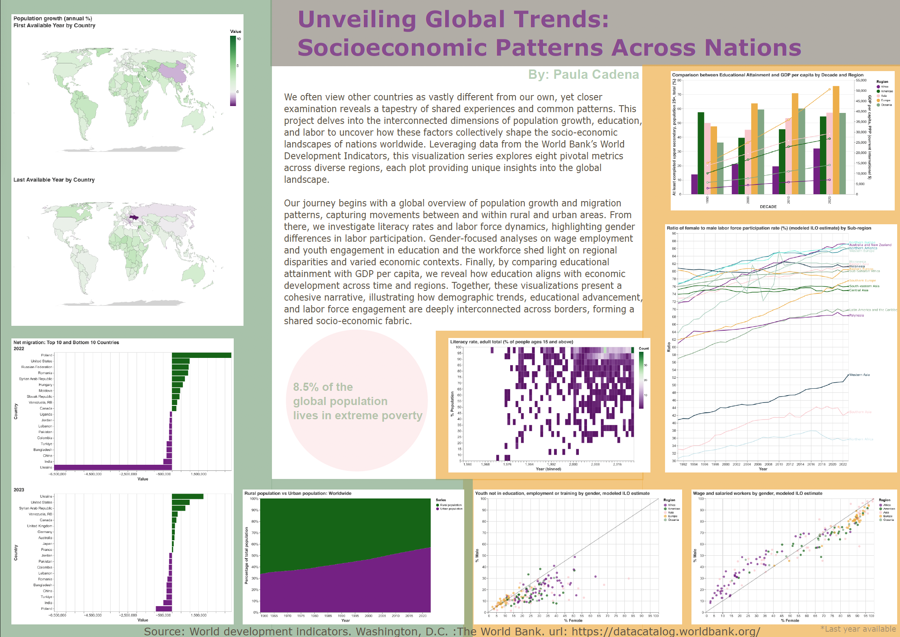

# Unveiling Global Trends: Socioeconomic Patterns Across Nations
### By: Paula Cadena

## Project Overview
This project presents a data visualization series that explores global socio-economic patterns using data from the World Bank’s World Development Indicators. Through visual analyses of population growth, education, and labor metrics, we aim to uncover relationships across regions and genders, offering insights into the interconnected nature of nations’ socio-economic landscapes.

## Source: 
World development indicators. Washington, D.C. :The World Bank. url: https://datacatalog.worldbank.org/

## Structure

- **LICENSE**: The license governing the use of this project (Based on the MIT License)
- **README.md**: This file, providing an overview of the project.
- **data/**: Contains data files.
  - `*.csv`: 5 CSV files containing partial data frames with metadata.
- **scratch/**: Contains exploratory script.
  - `exploration-draft.ipynb`: Jupyter notebook for data exploration and initial plots.
- **src/**: Main source files for generating visualizations and cleaning.
  - `plots.py`: Python script with functions for creating visualizations.
  - `theme.py`: Custom theme settings for consistent styling across visualizations.
  - `clean_data.py`: Python script that unify and clean the data frames
- **static_draft/**: Draft files for the visualizations.
  - `static-project.ipynb`: Notebook with exploratory visualizations and notes.
  - `proposal.md`: original proposal file
  - **plots/**: First versions using initial data
- **static_final/**: Finalized visualization files ready for presentation.
  - `final.pdf`: Final PDF report with visualizations and analysis.
  - `zine_layout.svg`: SVG layout for the presentation in a zine-style format.
  - `*.svg`: 8 SVG files containing each visualization result (created and saved in plots.py)

